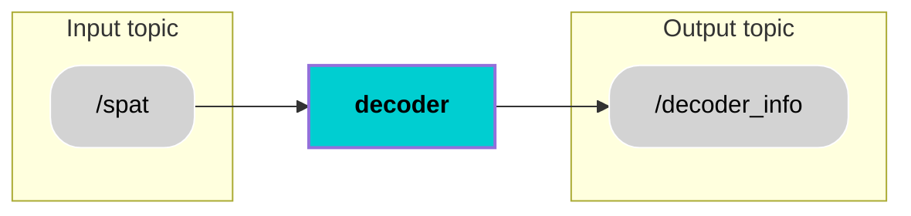

<div align="center">
  <h1 style="font-size: 36px;">Decoder</h1>
</div>

## 📚 Contents
- [Description](#-description)
- [Architecture](#-architecture)
- [Interfaces](#-interfaces)
- [User Stories](#-user-stories)
- [Installation](#-installation)
- [Usage](#-usage)
- [Contributor](#-contributor)
- [License](#-license)

## 🧠 Description
The Decoder node interprets incoming SPATEM (Signal Phase and Timing Message) data received from the `/spat` topic, which uses the `etsi_its_spatem_ts_msgs/msg/SPATEM` message type. It processes the message by first extracting the intersection_id and intersection_name, for each intersection it receives the signal_group and for each signal group it receives event_state.These decoded values are organized into a DecoderInfo.msg and published on the `/decoder_info` topic, which uses the `custom_msgs/msg/DecoderInfo` message type.

Functionally, the component acts as a translator between the complex ETSI ITS message hierarchy and the internal ROS 2 data flow. It ensures that only meaningful, ready-to-use traffic signal data is propagated through the system, reducing communication overhead and simplifying further processing. 
## 🧩 Architecture


## 🔌 Interfaces

### Topics:
| Name                         | IO      | Type                 | Description                                                              |
|------------------------------|---------|----------------------|--------------------------------------------------------------------------|
| `/spat`         | Input   | `etsi_its_spatem_ts_msgs/msg/SPATEM.msg`      |  Provides SPATEM (Signal Phase and Timing Message) containing traffic signal information from traffic lights                  |
| `/decoder_info`           | Output  | `custom_msg/msg/DecoderInfo.msg`      |       Provides simplified decoded traffic signal data, including intersection_id, signal_group, event_state and intersection_name           |

### Custom messages:
#### Message: `DecoderInfo.msg`
| **Name**         | **Type**           | **Description**                                                                 |
|------------------------|--------------------|---------------------------------------------------------------------------------|
| `intersection_id`      | `int32`         | The unique identifier for the intersection.                     |
| `signal_group`   | `int32`         | The signal group ID associated with the intersection.                                     |
| `event_state`     | `int32`         | The event state representing the current signal phase (e.g., RED:3,4,7 and GREEN=5).                  |
| `intersection_name`| `string`           | The name of the intersection.(e.g. modelcity-intersection-Y, modelcity-intersection-Z)             |

### Interface test process:
Process for testing the above interfaces can be found [here](interface_test.md).

## 🎯 User Stories
[US3.21](https://miro.com/app/board/uXjVI9mh4O0=/?moveToWidget=3458764647567204086&cot=14) : As a decoder, I want to receive SPAT messages and derive traffic signal information, so that I Can forward derived traffic signal information to Traffic Signal Monitor component. 

 
## 🛠️ Installation
1. Create workspace, src and go to src
```bash
mkdir temp_ws
cd temp_ws
mkdir src
cd src
```
2. Clone component repository
```bash
git clone https://git.hs-coburg.de/pax_auto/decoder.git
```
3. Clone custom messages repository
```bash
git clone https://git.hs-coburg.de/pax_auto/custom_msgs.git
```
4. Clone etsi_its_messages repository from ika-rwth-aachen
```bash
git clone https://github.com/ika-rwth-aachen/etsi_its_messages.git
```
5. Clone ad_infrastructure_services repository from Autonomous_Driving
```bash
git clone https://git.hs-coburg.de/Autonomous_Driving/ad_infrastructure_services.git
```
6. Return to workspace and build the packages
```bash
cd ..
colcon build --packages-select decoder custom_msgs etsi_its_spatem_ts_msgs ad_infrastructure_services
```
7. Source the setup files
```bash
source install/setup.bash
```


## ▶️ Usage
1.Start publishing /spat in modelcity:
```bash
ros2 run ad_infrastructure_services spatem_pubsub
```
2.Run the decoder node:
```bash
ros2 run decoder decoder_node
```

## 🧑‍💻 Contributor
[Harsh Mukeshbhai Bhadani](https://git.hs-coburg.de/harshbhadani) 

## 🔒 License
Licensed under the **Apache 2.0 License**. See [LICENSE](LICENSE) for details.


