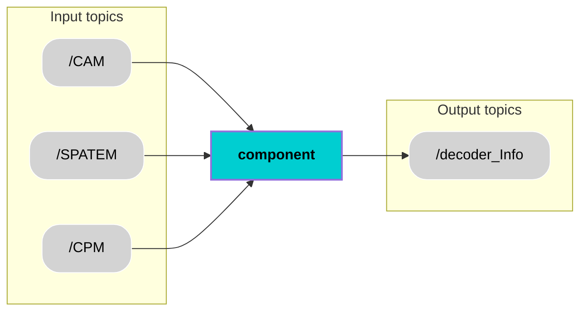

<div align="center">
  <h1 style="font-size: 36px;">Decoder</h1>
</div>

## 📚 Contents
- [Description](#-description)
- [Architecture](#-architecture)
- [Interfaces](#-interfaces)
- [User Stories & Acceptance Criteria](#-user-stories--acceptance-criteria)
- [Installation](#-installation)
- [Usage](#-usage)
- [Contributor](#-contributor)
- [License](#-license)

## 🧠 Description
The Decoder component processes raw V2X messages and converts them into structured, standardized data for internal use. It extracts critical information such as surrounding vehicle and pedestrian positions, emergency events, traffic signal states, and parking slot identifiers. Decoded data is stored until a complete set (CPM,SPATEM,CAM) is available, ensuring reliable and consistent output for downstream modules.

## 🧩 Architecture


## 🔌 Interfaces

### Topics:
| Name                         | IO      | Type                 | Description                                                              |
|------------------------------|---------|----------------------|--------------------------------------------------------------------------|
| `/cam`        | Input   | `std_msgs/String`      |   Receives Cooperative Awareness Messages (CAM) with data on nearby vehicles             |
| `/spatem`         | Input   | `std_msgs/String`      |  Receives Signal Phase and Timing (SPATEM) messages from traffic lights                  |
| `/cpm`              | Input   | `std_msgs/String`      | Receives Collective Perception Messages (CPM) indicating emergencies, parking    |
| `/decoder_Info`           | Output  | `custom_msg/msg/decoder_Info`      |       Publishes structured decoded V2X data               |
                  |

### Custom messages:
#### Message: `decoder_Info.msg`
| **Name**         | **Type**           | **Description**                                                                 |
|------------------------|--------------------|---------------------------------------------------------------------------------|
| `header`               | `std_msgs/Header`  | Standard ROS header with timestamp and frame ID                                |
| `nearby_vehicles`      | `string[]`         | List of detected nearby vehicles (e.g., by ID or label)                        |
| `nearby_pedestrians`   | `string[]`         | List of detected pedestrians in proximity                                      |
| `emergency_events`     | `string[]`         | Emergency-related events (e.g., ambulance, fire truck alerts)                  |
| `traffic_signal_status`| `string`           | Status of the traffic signal (e.g., "red", "green", "yellow")                 |
| `parking_slot_ids`     | `string[]`         | Identifiers of available or suggested parking slots                            |

### Interface test process:
Process for testing the above interfaces an be found [here](https://git.hs-coburg.de/pax_auto/m3_components/src/branch/main/1_component_template/interface_test.md).

## 🎯 User Stories & Acceptance Criteria
### Heading
**User Story x.x**  
_As a Decoder component, I want to receive real-time V2X messages (CAM, SPATEM, CPM) from other vehicles and infrastructure, so that I can decode the data and make it available to other onboard modules.
 
**Acceptance Criteria**  
- **x.x.1** The Decoder shall subscribe to `/cam`, `/spatem`, and `/cpm` topics and update the corresponding fields: `nearby_vehicles` and `nearby_pedestrians` from `/cam`, `traffic_signal_status` from `/spatem`, and `emergency_events` and `parking_slot_ids` from `/cpm`.  
- **x.x.2**  The Decoder shall create a DecoderInfo message with a valid `header.stamp` and publish it to `/decoder_info`.

## 🛠️ Installation
```bash
git clone xx.git
```

## ▶️ Usage
Run the node:
```bash
ros2 run xx xx
```

## 🧑‍💻 Contributor
[Mahitha Balachandran Sheeja](https://git.hs-coburg.de/mah5338s)

## 🔒 License
Licensed under the **Apache 2.0 License**. See [LICENSE](LICENSE) for details.

