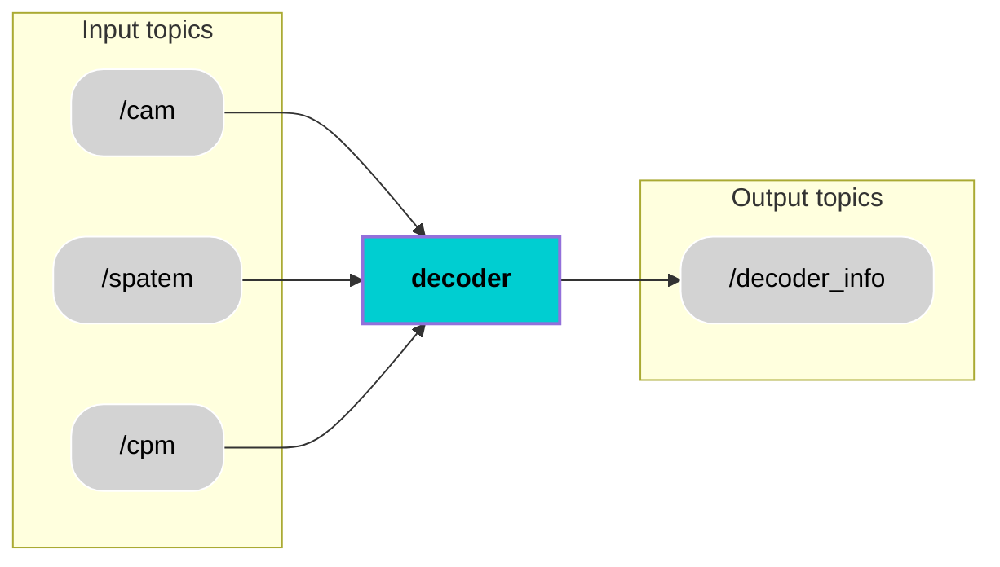

  <h1 style="font-size: 36px;">Decoder</h1>

## 📚 Contents
- [Description](#-description)
- [Architecture](#-architecture)
- [Interfaces](#-interfaces)
- [User Stories](#-user-stories)
- [Installation](#-installation)
- [Usage](#-usage)
- [Contributor](#-contributor)
- [License](#-license)

## 🧠 Description
The Decoder component processes raw V2X messages and converts them into structured, standardized data for internal use. It extracts critical information such as surrounding vehicle and pedestrian positions, emergency events, traffic signal states, and parking slot identifiers. Decoded data is stored until a complete set (CPM,SPATEM,CAM) is available, ensuring reliable and consistent output for downstream modules.

## 🧩 Architecture

## 🔌 Interfaces

### Topics:
| Name                         | IO      | Type                 | Description                                                              |
|------------------------------|---------|----------------------|--------------------------------------------------------------------------|
| `/cam`        | Input   | `v2x_msgs/msg/CAM.msg`      |   Receives Cooperative Awareness Messages (CAM) with data on nearby vehicles             |
| `/spatem`         | Input   | `v2x_msgs/msg/SPATEM.msg`      |  Receives Signal Phase and Timing (SPATEM) messages from traffic lights                  |
| `/cpm`              | Input   | `v2x_msgs/msg/CPM.msg`      | Receives Collective Perception Messages (CPM) indicating emergencies, parking    |
| `/decoder_Info`           | Output  | `custom_msg/msg/decoder_Info.msg`      |       Publishes structured decoded V2X data               |
                  |

### Custom messages:
#### Message: `decoder_Info.msg`
| **Name**         | **Type**           | **Description**                                                                 |
|------------------------|--------------------|---------------------------------------------------------------------------------|
| `header`               | `std_msgs/Header`  | Standard ROS header with timestamp and frame ID                                |
| `nearby_vehicles`      | `string[]`         | List of detected nearby vehicles (e.g., by ID or label)                        |
| `nearby_pedestrians`   | `string[]`         | List of detected pedestrians in proximity                                      |
| `emergency_events`     | `string[]`         | Emergency-related events (e.g., ambulance, fire truck alerts)                  |
| `traffic_signal_status`| `string[]`           | Status of the traffic signal (e.g., "red", "green", "yellow")                 |
| `parking_slot_ids`     | `string[]`         | Identifiers of available or suggested parking slots                            |

### Interface test process:
Will be implemented in next Module.

## 🎯 User Stories
Will be created in next Module
 
## 🛠️ Installation
ROS2 package will be implemented in next Module.

## ▶️ Usage
ROS2 package will be implemented in next Module.

## 🧑‍💻 Contributor
[Mahitha Balachandran Sheeja](https://git.hs-coburg.de/mah5338s)

## 🔒 License
Licensed under the **Apache 2.0 License**. See [LICENSE](LICENSE) for details.

