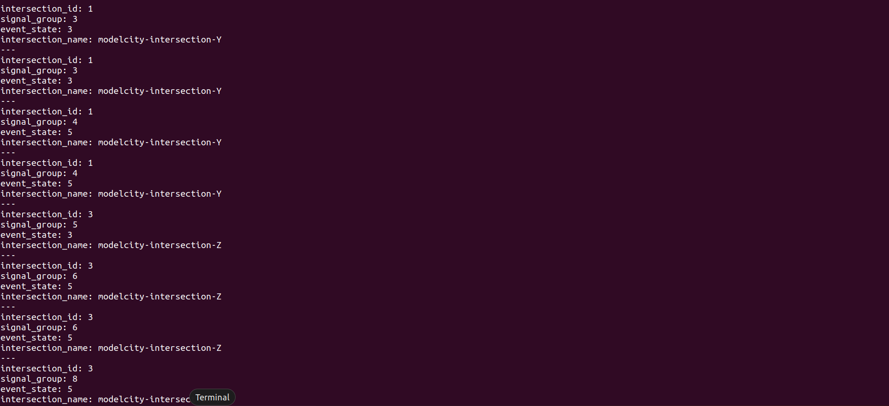

# Procedure to do interface test
1. Follow the installation and usage procedure from component repository to launch the ROS2 package

2. Open new terminal
    ```bash
    source install/setup.bash
    ros2 topic echo /decoder_info
    ```
3. Output in terminal should look like this: 
    
    
